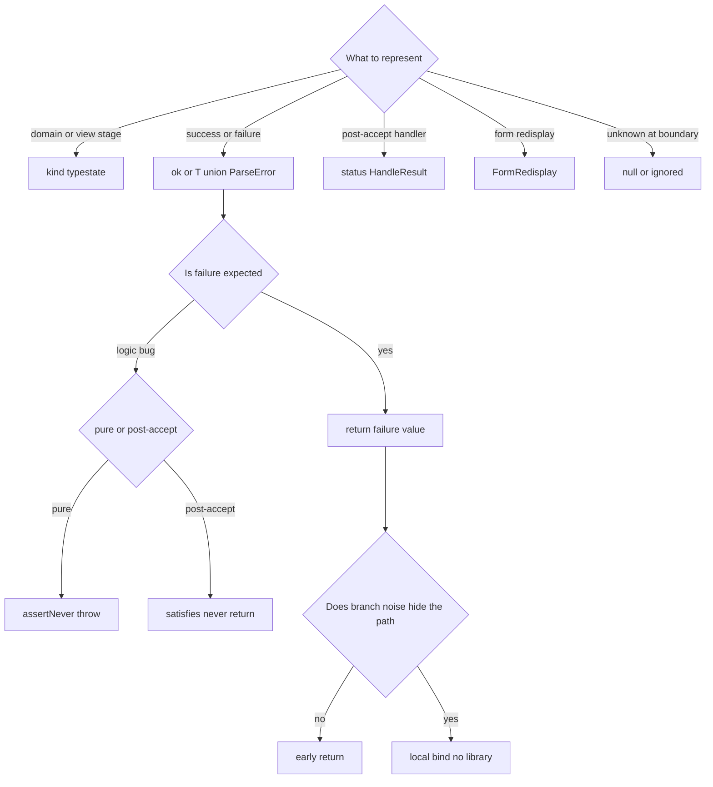

# Envelopes and control

How the catalog already splits **what a value means** from **how failure is handled**. Railway-oriented programming (`bind`) is only a composition style for expected failures-as-values. It is not a fourth envelope.

This note does **not** add fp-ts, Zod, or a `bind` helper. Control rules live here. When to add a library after you already chose `bind`: [fp-ts-and-pbt.md](./fp-ts-and-pbt.md).



`kindTag`, `statusTag`, `redisplay`, and `soft` are terminals. They never enter ROP.

## 1. Do not unify envelopes

| Envelope | Discriminator | Meaning | Where |
| --- | --- | --- | --- |
| Domain / view stage | `{ kind }` | Not success/failure | [ticket.ts](./state-and-result/src/ticket.ts), [viewState.ts](./state-and-result/src/viewState.ts) |
| Operation / parse result | `{ ok }` or `T \| ParseError` | Expected success or failure | [assign.ts](./state-and-result/src/assign.ts), [boundary.ts](./always-valid-pipeline/src/boundary.ts), [brands.ts](./order-pipeline/src/brands.ts) |
| Command result | `{ ok }` + closed `reason` | Domain command outcome | [envelopes.ts](./state-and-result/src/envelopes.ts) `CommandResult` |
| UI redisplay | loose `{ ok }` + optional fields | Screen only. Not a command | same file `FormRedisplay` |
| Post-accept handler | `{ status }` | `accepted` / `duplicate` / `ignored` | [inbox.ts](./effects-at-boundary/src/inbox.ts) `HandleResult` |

Forbidden: collapsing `{ kind }` and `{ ok }` into one `Either`. ROP's two tracks carry **success or failure**, not draft / open / closed. Those are a state machine.

The same `{ ok }` tag is not the same envelope. `ParseResult`, `AssignResult`, `CommandResult`, and `FormRedisplay` meet only through an explicit conversion (`commandToRedisplay`). Do not `bind` across them.

## 2. Two result encodings

Do not treat `{ ok }` as the only result shape. Types are not shared across packages.

| Encoding | Shape | Used by |
| --- | --- | --- |
| Tagged result | `{ ok: true, value } \| { ok: false, reason }` | Catalog L2 [boundary.ts](./always-valid-pipeline/src/boundary.ts); catalog L1 [assign.ts](./state-and-result/src/assign.ts) |
| Value-or-error | `T \| { kind: "ParseError" }` | Canonical [brands.ts](./order-pipeline/src/brands.ts) |

`ParseError.kind` is an error discriminant. It is **not** typestate. Domain `{ kind: "draft" }` and `{ kind: "ParseError" }` must not share a union.

The rule is: do not mix success/failure with domain stage. The rule is not: make every tag name match.

## 3. Pick control from the kind of failure

These three are not substitutes. ROP composes only the first.

- **Expected failure** (ticket not open, malformed JSON): return a failure value. Do not throw. See the comment on [assign.ts](./state-and-result/src/assign.ts).
- **Must not happen** (missing `switch` variant): in a pure function, `assertNever` may throw ([assertNever.ts](./state-and-result/src/assertNever.ts), [orderTypestate.ts](./order-pipeline/src/orderTypestate.ts)). After inbox accept, throw is forbidden, including `assertNever`. Exhaustiveness is `satisfies never` and `return` ([inbox.ts](./effects-at-boundary/src/inbox.ts)).
- **Unknown at the boundary** (unknown widget, unknown inbox action): no throw, no side effect. `null` / `ignored` ([softFallback.ts](./state-and-result/src/softFallback.ts), `handleUnknownAction`).

Neither throw rule is universal. Read both package READMEs. The pair is also summarized in [README.md](./README.md).

## 4. When to use ROP

ROP is `bind` on a result: run the next step only on success. This repository's default is the **same result type, no chain**.

```ts
/** Early return — no `Either` / ROP chain. */
export function assignThenDescribe(...) {
  const result = assignTicket(ticket, assigneeId);
  if (!result.ok) return result;
  return { ok: true, summary: describeTicket(result.ticket) };
}
```

See [assign.ts](./state-and-result/src/assign.ts).

There is **no** `bind` helper in this repo. The useful part of this section is the negative rule (when not to chain). Step count is not a magic number; the test is whether branch noise hides the happy path.

1. **Default**: early return. One or two stations, reasons stay local. [state.test.ts](./state-and-result/test/state.test.ts) pins this contract.
2. **Local `bind`**: only when a parse or pure-transform pipeline is long enough that `if (!ok)` noise hides the work. No library. A file-local helper is enough:

```ts
const bind = <A, B>(
  r: { ok: true; value: A } | { ok: false; reason: string },
  f: (a: A) => { ok: true; value: B } | { ok: false; reason: string },
) => (r.ok ? f(r.value) : r);
```

That snippet is illustrative. It is not compiled in this repo.

3. **Do not use ROP** for: a path that already performed a side effect (bind is not compensation), `{ kind }` transitions, after inbox accept, wiring straight into `FormRedisplay`, or chaining two different `{ ok }` envelopes.

Layer 2 "Parse, don't validate" pipelines fit ROP at the **boundary**. The current [safeParseTicketInput](./always-valid-pipeline/src/boundary.ts) is a single function with early return; that is enough. Inner APIs take the success type only (`publish(ticket: Ticket)`). Keep ROP outside the inner API.

If you already chose local `bind` and a library would still help, that is a tooling decision: [fp-ts-and-pbt.md](./fp-ts-and-pbt.md).

## 5. Layers

Layer numbers classify scope. They are not a data timeline.

- **L2**: parse at the boundary into a result; on success, mint the domain type. Failure is a value. Branding is not a uniqueness or idempotency proof.
- **L1**: `{ kind }` exhaustiveness is the proof. Command success/failure is a **different** envelope. ROP is a composition style for that envelope.
- **L4**: time, reuse, redelivery. `HandleResult` and no-throw after accept. Property-based tests check laws on samples; they do not replace a result type. See [fp-ts-and-pbt.md](./fp-ts-and-pbt.md).
- **L3**: out of scope. Do not lift envelopes into AAT.

## 6. Claim boundary

This note does not introduce fp-ts. ROP here is the criterion for considering `bind`, not a new defense layer and not a new demo package.
